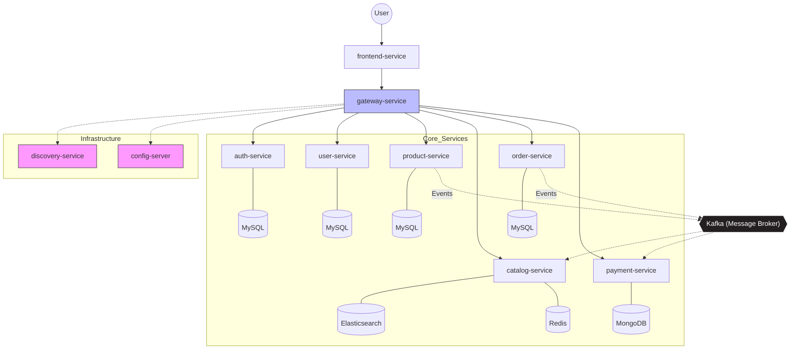
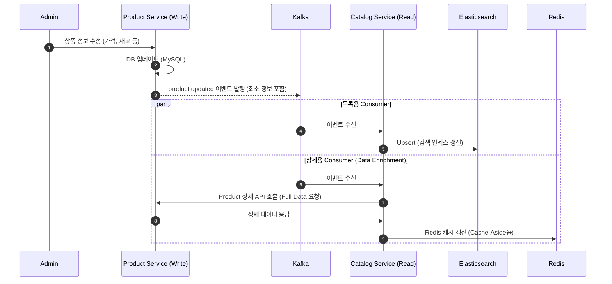
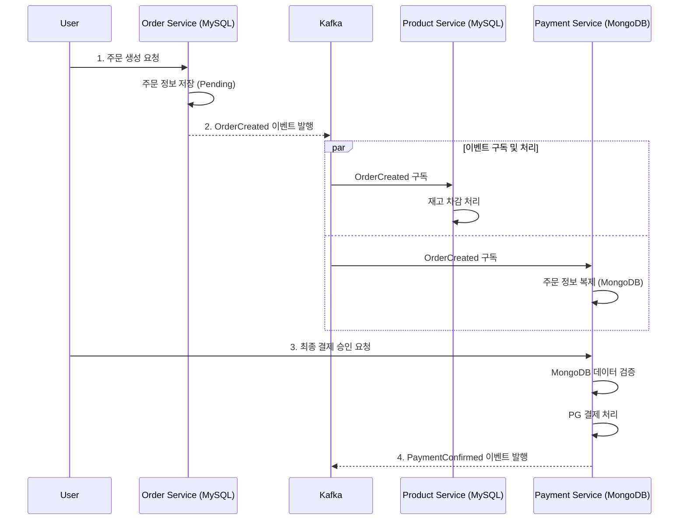

# ecommerce-msa
Spring Cloud를 활용한 MSA 기반 이커머스 서비스 구현 프로젝트

## 프로젝트 개요

본 프로젝트는 Spring Cloud 기반으로 구축한 MSA 전자 상거래 시스템이다.
도메인별 설계 상세 방법을 정리한 내용이다.

### 아키텍처 구성도

원래 MSA에서는 각 서비스가 자체 데이터 저장소(RDBMS, Redis 등)를 갖지만, 실습의 편의를 위해 RDBMS를  
사용하는 서비스들은 **하나의 MySQL 서버에서 논리적으로 분리된 데이터베이스를 사용하도록 할 예정**이다.  

#### Saga Pattern
Saga Pattern은 하나의 비즈니스 행위가 여러 서비스에 걸쳐 수행되며, 해당 행위가 도메인 관점에서 원자적으로  
보장되어야 할 때 사용된다. 즉, 중간 단계에서 실패가 발생했을 경우 이전 상태로 되돌리지 않으면 비즈니스적으로  
잘못된 상태가 되는 경우에 보상 트랜잭션을 통해 일관성을 유지한다.  

예를 들어, 재고 차감 이후 주문을 확정하는 과정에서 주문 생성에 실패했다면, 차감된 재고는 반드시 원상태로  
복구되어야 한다. 이와 같은 경우 부분 성공 상태는 허용되지 않으므로 Saga Pattern이 적합하다.  

반면, 회원 가입 후 user.registered 이벤트를 발행하고 인증 서비스에서 인증 정보를 생성하는 흐름은 중간 실패가  
발생하더라도 나중에 재처리가 가능하며, 회원 가입 자체를 되돌릴 필요는 없다.  
따라서 이러한 경우에는 Saga Pattern까지 도입할 필요는 없고, Retry나 DLQ 기반의 실패 처리 전략으로 충분하다.  

### 유틸 서비스

* Config-Server
  * Spring Boot 기반 서비스들의 설정 서버이며 [해당 Git 저장소](https://github.com/gr1993/ecommerce-msa-config)에서 설정 정보를 로딩한다.
* discovery-service
  * 각 마이크로서비스의 등록 및 위치 정보를 관리하고, 다른 서비스들이 이를 통해 동적으로 서로를 찾을 수 있도록 지원하는 서비스
* Gateway-Service
  * 인증/인가(토큰 검증)
  * 로깅
  * RateLimit
  * 모니터링
  * CORS
  * 서비스 장애 시 CircuitBreaker
* Auth-Service
  * 로그인, 토큰 발급·갱신
  * JWT 서명(Signing Key) 관리
  * 토큰 유효성 검증(또는 검증용 공개키 제공)

### 사용자 서비스

* 사용자 프로필 관리
* 회원 등급, 적립 포인트, 쿠폰 소유 목록 등 도메인 데이터
* 주문자 정보 제공
* 회원 정보 수정 등 사용자 중심 기능

### 상품 / 카탈로그 서비스

상품(Product)과 카탈로그(Catalog)는 역할과 데이터 구조가 다르기 때문에 별도의 서비스로 분리하였다.  
Product-Service는 관리자가 상품을 등록·수정·삭제하는 원본 데이터 관리 영역이며, 옵션·SKU·재고·가격 등  
상품의 실제 속성과 운영 정보가 이곳에서 관리된다.  
  
반면 Catalog-Service는 고객이 사용하는 상품 전시 전용 서비스로, 목록 조회·검색·필터링 등  
읽기 중심의 고성능 기능을 담당한다. 고객 트래픽이 집중되는 영역이기 때문에 성능 최적화, 캐싱, 검색  
구조가 중요하며 이를 위해 서비스 분리가 필요하다.  
  
여기서 SKU(Stock Keeping Unit)는 재고를 관리하는 최소 단위로, 단순 상품이 아니라 색상·사이즈 등  
옵션 조합을 포함한 실제 판매 단위를 의미한다. 재고는 SKU 단위로 관리된다.  
  
상품 정보(재고, 할인, 품절 여부 등)가 변경되면 Product-Service가 Kafka 이벤트를 발행하고,  
Catalog-Service는 이를 구독하여 전시용 데이터에 반영한다. 이를 통해 Redis 캐싱, Elasticsearch 검색  
등 다양한 저장소를 활용한 조회 최적화를 수행할 수 있다.  

### 주문 / 결제 서비스

Payment-Service는 외부 PG사 연동, 결제 승인 및 상태 관리, 결제 이력 저장을 전담하며,  
Order-Service로부터 결제 로직을 분리하여 서비스 간 응집도를 높였다. 재고 관리는 주문 생성 시점에  
선차감을 수행하며, 결제 실패 시 보상 트랜잭션을 통해 재고를 복구하는 방식으로 설계하였다.  

#### 주문 단계
1. 주문 생성 및 재고 선점 : Order-Service에서 주문 데이터를 생성하고 상태를 PENDING으로 설정한다. 이와 동시에 Product-Service에서 order.created 이벤트를 구독하여 해당 상품의 SKU 재고를 즉시 차감하여 구매 권한을 선점한다.
2. 결제 승인 및 검증 : 클라이언트가 PG사를 통해 결제를 완료하면, 서버는 실제 주문 금액과 PG 승인 금액의 일치 여부를 검증한다. 검증 결과에 따라 주문 상태를 PAID 또는 FILED로 전환한다.
3. 데이터 정합성 보장 : 결제 실패 또는 타임아웃 발생 시, 이벤트를 통해 차감되었던 재고를 자동으로 복구(Rollback)하여 시스템 전반의 데이터 정합성을 유지한다.

### 할인 / 정산 서비스

상품 할인과 쿠폰 적용을 처리하는 서비스를 별도로 구성하여, 상품별 할인 및 쿠폰 적용 여부를 계산한 후  
최종 결제 금액을 Order-Service에 제공하는 형태로 설계할 예정이다.  
또한, 이 시스템에서 발생한 매출·거래 데이터는 정산 서비스에서 별도로 관리하여, 정산 프로세스가 다른 서비스와  
분리된 상태에서 안정적으로 운영되도록 한다. Settlement-Service는 각 서비스에서 발생한 도메인 이벤트  
(예: OrderCompleted, PaymentCancelled 등)를 구독하여, 정산 전용 DB에 저장하는 방식으로 동작한다.  

### 배송 / 반품 서비스

배송사 API 연동을 통해 배송 상태를 관리하는 서비스를 추가할 예정이다.  
배송이 완료된 후에도 최종 확정 단계를 관리하며, 소비자가 만족하지 않을 경우 반품·환불·교환 프로세스를  
처리할 수 있도록 별도의 Return/Refund 서비스를 설계할 예정이다.  
환불 요청이 발생하면 Return-Service가 Payment-Service에 REST API를 통해 결제 취소를 요청하며,  
주문 상태 업데이트, 재고 롤백, 정산 반영 등 나머지 후속 처리는 Kafka 이벤트 구독 방식으로 처리하도록 구성한다.  