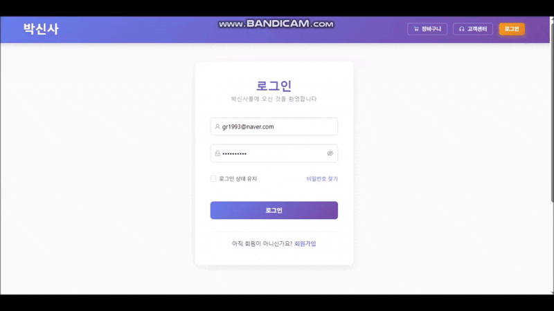
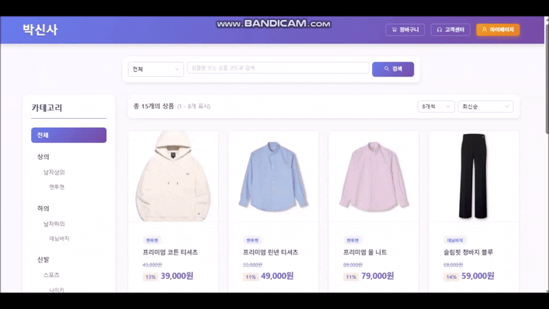
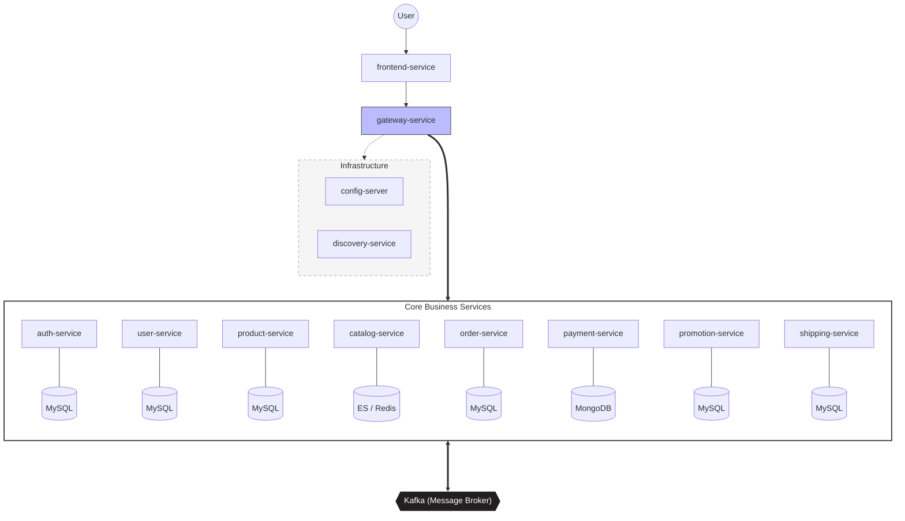
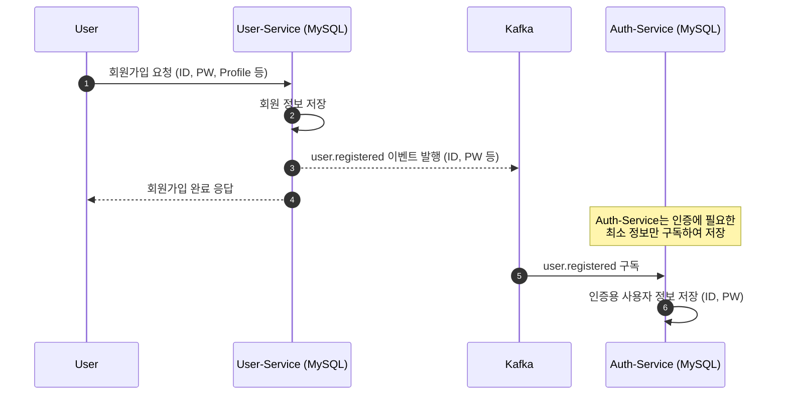
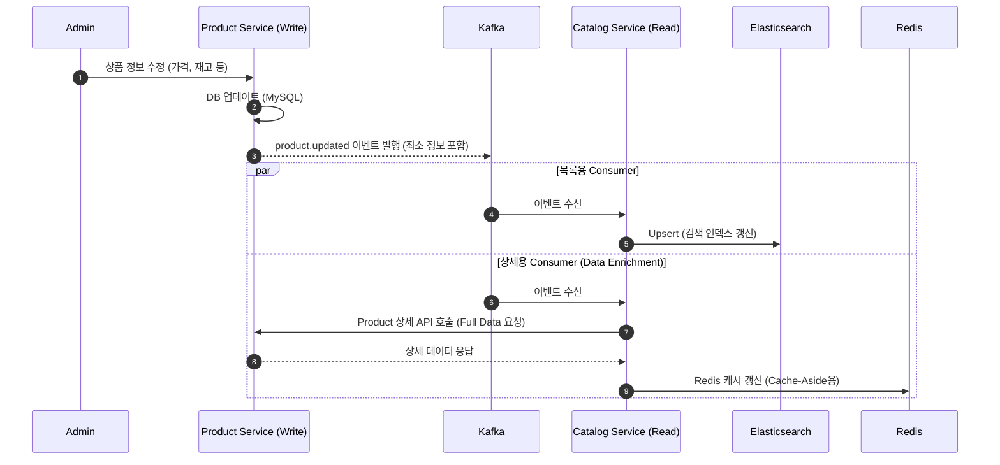
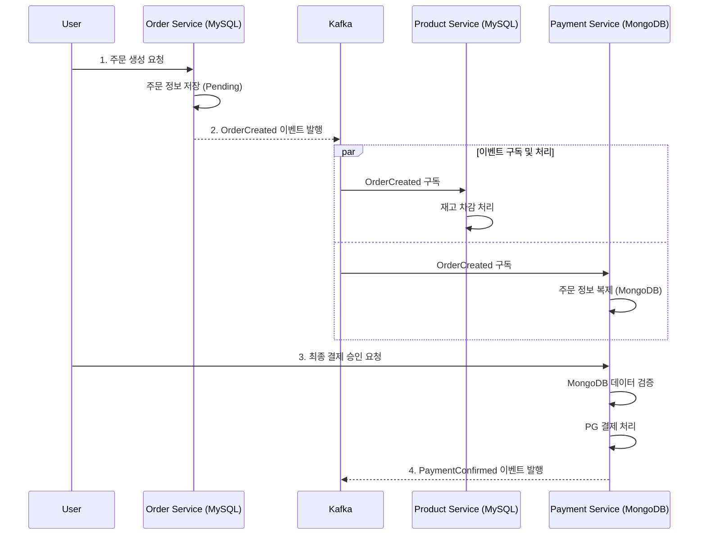
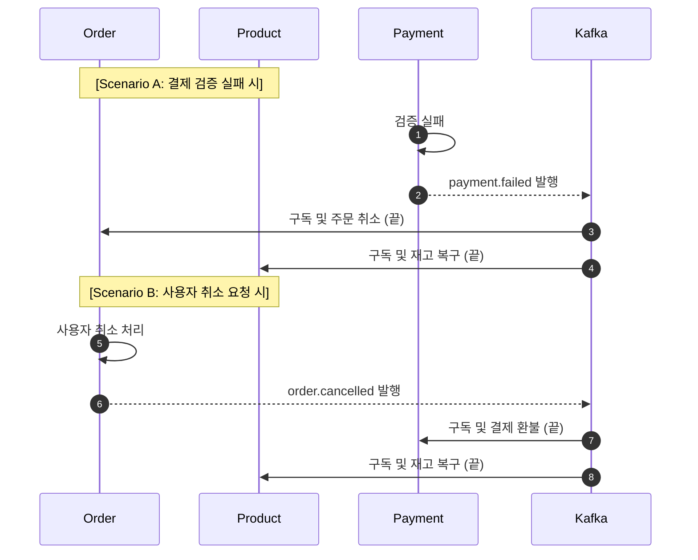
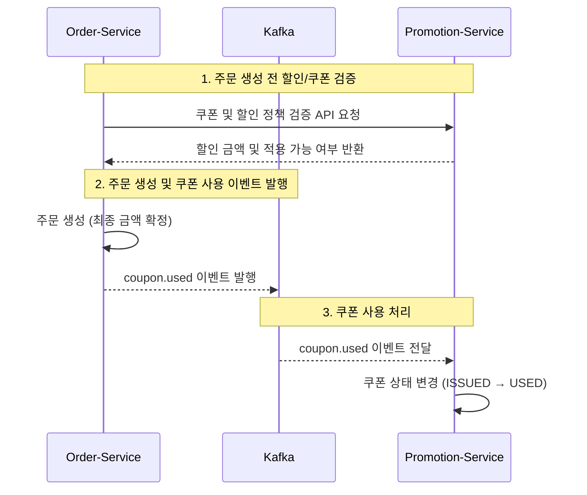
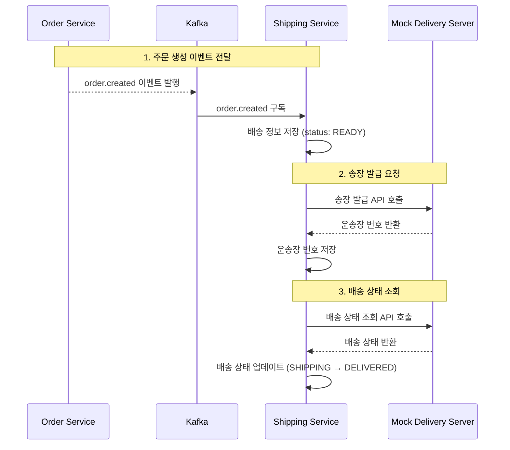

# ecommerce-msa
Spring Cloud를 활용한 MSA 기반 이커머스 서비스 구현 프로젝트

### 박신사 관리자

### 박신사 마이페이지

### 박신사 주문 시연

## 프로젝트 개요

각 도메인의 책임 분리와 서비스 간 협력 방식을 중심으로 설계 내용을 정리하였다.

### 기술 스택
* **Frontend:** React (`frontend-service`)
* **Backend:** Spring Boot (Gateway를 포함한 나머지 모든 마이크로서비스)

### 아키텍처 구성도
원래 MSA에서는 각 서비스가 자체 데이터 저장소(RDBMS, Redis 등)를 갖지만, 실습의 편의를 위해 RDBMS를  
사용하는 서비스들은 **하나의 MySQL 서버에서 논리적으로 분리된 데이터베이스를 사용하도록 할 예정**이다.  
인프라 및 서비스를 구축하려면 [infra 폴더의 README 파일](https://github.com/gr1993/ecommerce-msa/tree/main/infra)을 참고하여 구성할 수 있다.

### Saga Pattern
Saga Pattern은 하나의 비즈니스 행위가 여러 서비스에 걸쳐 수행되며, 해당 행위가 도메인 관점에서 원자적으로  
보장되어야 할 때 사용된다. 즉, 중간 단계에서 실패가 발생했을 경우 이전 상태로 되돌리지 않으면 비즈니스적으로  
잘못된 상태가 되는 경우에 보상 트랜잭션을 통해 일관성을 유지한다.  

예를 들어, 재고 차감 이후 주문을 확정하는 과정에서 주문 생성에 실패했다면, 차감된 재고는 반드시 원상태로  
복구되어야 한다. 이와 같은 경우 부분 성공 상태는 허용되지 않으므로 Saga Pattern이 적합하다.  

반면, 회원 가입 후 user.registered 이벤트를 발행하고 인증 서비스에서 인증 정보를 생성하는 흐름은 중간 실패가  
발생하더라도 나중에 재처리가 가능하며, 회원 가입 자체를 되돌릴 필요는 없다.  
따라서 이러한 경우에는 Saga Pattern까지 도입할 필요는 없고, Retry나 DLQ 기반의 실패 처리 전략으로 충분하다.  

### 유틸 서비스

* Config-Server
  * Spring Boot 기반 서비스들의 설정 서버이며 [해당 Git 저장소](https://github.com/gr1993/ecommerce-msa-config)에서 설정 정보를 로딩한다.
* discovery-service
  * 각 마이크로서비스의 등록 및 위치 정보를 관리(다른 서비스들이 이를 통해 동적으로 서로를 찾을 수 있도록 지원)
* Gateway-Service
  * 토큰 검증 기반 인가
  * 로깅
  * RateLimit
  * 모니터링
  * CORS
  * 서비스 장애 시 CircuitBreaker

### 사용자 / 인증 서비스

Auth-Service는 인증과 관련된 책임만을 가지며, 로그인 시 JWT 토큰을 발급하는 역할을 수행한다.  
토큰의 검증 및 인가 처리는 Gateway-Service에서 담당하여, 인증과 인가의 책임을 명확히 분리한다.  
User-Service는 회원가입을 포함한 사용자 관련 API와 관리자 페이지에서의 회원 정보 관리 기능을 담당한다.  
회원가입 또는 회원 정보 수정 요청이 User-Service로 유입되면, user.registered 등 같은 도메인 이벤트가 발행된다.  
Auth-Service는 해당 이벤트를 구독하여 인증에 필요한 사용자 정보를 자체 인증 저장소에 반영한다.  

### 상품 / 카탈로그 서비스

상품(Product)과 카탈로그(Catalog)는 역할과 데이터 구조가 다르기 때문에 별도의 서비스로 분리하였다.  
Product-Service는 관리자가 상품을 등록·수정·삭제하는 원본 데이터 관리 영역이며, 옵션·SKU·재고·가격 등  
상품의 실제 속성과 운영 정보가 이곳에서 관리된다.  
  
반면 Catalog-Service는 고객이 사용하는 상품 전시 전용 서비스로, 목록 조회·검색·필터링 등  
읽기 중심의 고성능 기능을 담당한다. 고객 트래픽이 집중되는 영역이기 때문에 성능 최적화, 캐싱, 검색  
구조가 중요하며 이를 위해 서비스 분리가 필요하다.  
  
여기서 SKU(Stock Keeping Unit)는 재고를 관리하는 최소 단위로, 단순 상품이 아니라 색상·사이즈 등  
옵션 조합을 포함한 실제 판매 단위를 의미한다. 재고는 SKU 단위로 관리된다.  
  
상품 정보(재고, 할인, 품절 여부 등)가 변경되면 Product-Service가 Kafka 이벤트를 발행하고,  
Catalog-Service는 이를 구독하여 전시용 데이터에 반영한다. 이를 통해 Redis 캐싱, Elasticsearch 검색  
등 다양한 저장소를 활용한 조회 최적화를 수행할 수 있다.  

### 주문 / 결제 서비스

Payment-Service는 외부 PG사 연동, 결제 승인 및 상태 관리, 결제 이력 저장을 전담하며,  
Order-Service로부터 결제 로직을 분리하여 서비스 간 응집도를 높였다. 재고 관리는 주문 생성 시점에  
선차감을 수행하며, 결제 실패 시 보상 트랜잭션을 통해 재고를 복구하는 방식으로 설계하였다.  

#### 주문 단계
1. 주문 생성 및 재고 선점 : Order-Service에서 주문 데이터를 생성하고 상태를 PENDING으로 설정한다. 이와 동시에 Product-Service에서 order.created 이벤트를 구독하여 해당 상품의 SKU 재고를 즉시 차감하여 구매 권한을 선점한다.
2. 결제 승인 및 검증 : 클라이언트가 PG사를 통해 결제를 완료하면, 서버는 실제 주문 금액과 PG 승인 금액의 일치 여부를 검증한다. 검증 결과에 따라 주문 상태를 PAID 또는 FAILED로 전환한다.
3. 데이터 정합성 보장 : 결제 실패 또는 타임아웃 발생 시, 이벤트를 통해 차감되었던 재고를 자동으로 복구(Rollback)하여 시스템 전반의 데이터 정합성을 유지한다.

#### 데이터 일관성 전략 (주문 취소 및 결제 실패)

여러 유스케이스에 따라 다양한 이벤트가 발행되며, 이 과정에서 주문 취소 상황이 발생할 수 있다.  
결제 취소가 발생한 경우뿐만 아니라, 주문 취소가 직접 발생한 경우에도 재고 롤백은 반드시 수행되어야 한다.  

만약 Order-Service가 결제 취소 이벤트를 구독한 뒤 주문을 취소하고, 그 결과로 다시 주문 취소 이벤트를  
발행하는 구조를 선택할 경우, Product-Service는 결제 취소 이벤트와 주문 취소 이벤트를 모두 구독하고  
있기 때문에 재고 롤백 로직이 중복 실행될 위험이 있다. (멱등성 처리를 적용하여 실제 재고가 두 번  
롤백되지는 않지만, 불필요한 처리 비용은 발생한다.)  

또한 이러한 방식으로 이벤트를 설계할 경우, 결제 취소 → 주문 취소 → 결제 취소와 같은 이벤트 순환 참조가  
발생할 수 있으며, 이는 이벤트가 무한히 반복되는 심각한 문제로 이어질 수 있다.  

이를 방지하기 위해 결제 서비스 주도(결제 검증 실패)와 주문 서비스 주도(사용자 또는 CS에 의한 취소) 방식의  
책임을 명확히 분리한다. **각 서비스는 이벤트를 구독하더라도 추가적인 이벤트를 발행하지 않고, 자신의 상태를  
업데이트한 후 해당 유스케이스를 종료**한다. 이러한 설계를 통해 각 서비스는 전달받은 이벤트를 기반으로  
자신이 담당하는 작업 또는 보상 트랜잭션만 수행하며, 이벤트 순환 참조를 원천적으로 차단한다.  

### 프로모션 서비스

Promotion-Service는 관리자 페이지를 통해 카테고리, 상품, 주문 단위의 할인 정책과 쿠폰을 등록·관리한다.  
사용자는 쇼핑몰에서 쿠폰 번호를 등록함으로써 해당 쿠폰을 소유하게 되며, 이와 관련된 모든 데이터는 Promotion-Service에서 관리된다.  
회원이 주문을 생성할 때, 적용 가능한 할인 정책이나 보유 쿠폰을 사용하려면 Order-Service는 Promotion-Service에  
REST API로 검증 요청을 보낸다. Promotion-Service는 할인 적용 가능 여부와 최종 할인 금액을 반환하고,  
이를 기반으로 Order-Service가 주문을 생성한다.  
주문이 완료되어 쿠폰 사용이 확정되면, Order-Service는 쿠폰 사용 이벤트를 발행한다.  
Promotion-Service는 해당 이벤트를 구독하여 쿠폰 상태를 최종적으로 사용 처리한다.  

### 배송 서비스(+ 반품, 교환)

원래는 배송 서비스와 반품 서비스를 분리하여 개발할 계획이었다.  
그러나 현재 모든 서비스를 로컬 PC에서 구동하고 있으며, 사이드 프로젝트 특성상 인프라 복잡도를 최소화하기 위해  
Shipping-Service에서 배송, 반품, 교환 기능을 모두 지원하도록 결정하였다.  
이 서비스의 핵심인 배송 처리 프로세스에서는 실제 업무처럼 외부 API(스마트 택배나 특정 택배사 API)를 사용하여  
송장 발급 및 발송을 처리하려 했으나, PG 결제 모듈과 달리 배송까지 테스트할 수 있는 서비스가 없었고, 조회 또한 실제  
배송 중인 택배만 추적 가능했다. 따라서 직접 배송 및 추적을 지원하는 **Mock 서버를 구현**하고, 이를 Shipping-Service와  
연동하여 시뮬레이션 환경을 구성하였다.  
또한 배송과 관련된 테이블의 쓰기 책임은 Shipping-Service가 전담하며, Order-Service는 배송 처리 이벤트를  
구독하여 배송 관련 정보를 읽기 전용으로 관리한다.  

### 정산 / 분석 서비스

원래 이 프로젝트에서 정산 서비스(Settlement)와 분석 서비스(Analytics, 통계/대시보드)까지 모두 구현할 계획이었으나,  
현재 로컬 환경에서 MySQL, Kafka(3대), MongoDB, Elasticsearch 등 다수의 인프라 서비스와 모든 마이크로서비스를 동시에  ㅇ
구동하다 보니 PC 전체 리소스가 한계에 달하는 문제가 발생했다.  

이에 따라 정산과 분석 서비스는 별도의 사이드 프로젝트로 분리하기로 결정하였다. 두 서비스는 이벤트 소비와 DB 처리  
중심으로 동작하기 때문에, 기존 주문/결제/배송 서비스 없이도 이벤트 시뮬레이션만으로 충분히 개발 및 로직 검증이 가능하다.  

또한, 정산/분석 서비스는 MSA 이벤트 기반 통합 흐름과 달리 스트리밍 처리, Kafka Streams, KSQL, 스트림 조인 등 실시간  
통계와 집계 중심의 구현이 필요하기 때문에, 별도로 분리하는 것이 개발과 테스트 효율, 포트폴리오 관점 모두에서 유리하다.  
이렇게 나누면, 프로젝트 규모를 적절히 유지하면서 각 서비스의 목적과 책임을 명확하게 구분할 수 있는 장점이 있다.