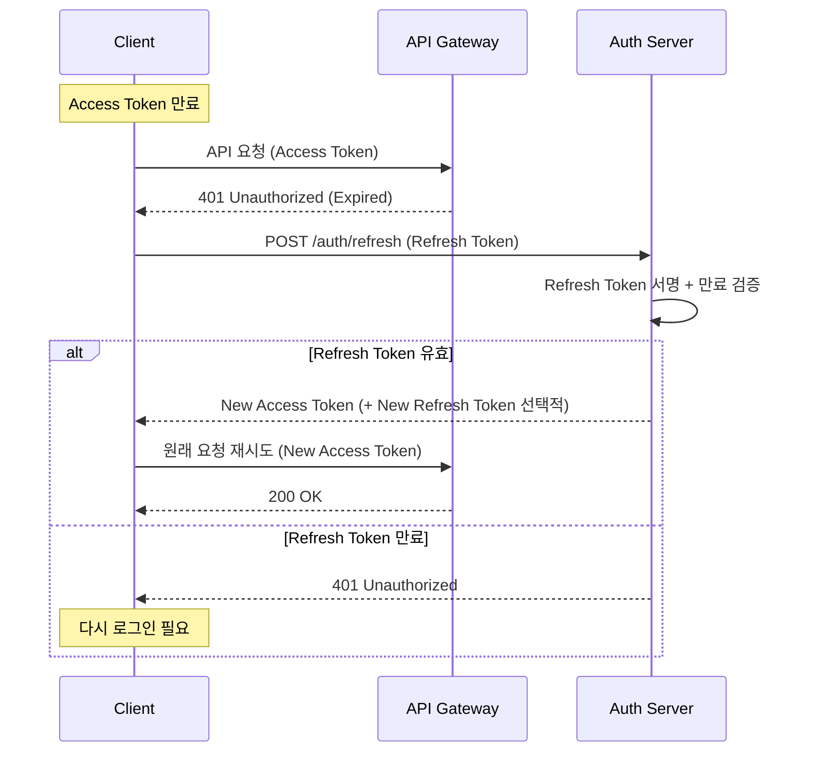

# auth-service
JWT 기반 인증 토큰 발급 및 검증을 담당하는 MSA 서비스


### 토큰 정책

토큰 정책은 아래와 같다.
* Access Token 만료 시간 : 30분
* Refresh Token 만료 시간 : 7일

Access Token은 탈취 시 보안 위험이 있으므로 만료 시간을 짧게, 약 30분 정도로 설정하였다.  
API 요청 전에 Access Token의 만료 시간을 확인하고, 만료되었거나 만료까지 5분 이내인 경우에는 Refresh Token을 이용해  
토큰 갱신 API를 호출하여 새로운 Access Token을 발급받은 뒤 API 요청을 진행한다.  
현업에서는 Refresh Token 재발급 시 기존 토큰을 무효화하는 Rotation 방식을 사용하지만, 사이드 프로젝트 특성상 기존  
Refresh Token은 그대로 사용한다. 만약 토큰 갱신 API 호출이 실패하면, 클라이언트는 재로그인을 유도한다.  


### 프로젝트 패키지 구조
```
com.example.authservice
├── common              # 유틸리티, 공통 상수
├── config              # 설정 클래스 (Security, JWT, CORS, Swagger 등)
├── consumer            # Kafka 이벤트 컨슈머
├── controller          # API 엔드포인트 (REST Controller)
├── domain
│   ├── entity/         # DB와 매핑되는 JPA 엔티티
│   └── event/          # 도메인 이벤트 클래스
├── dto                 # Request/Response 데이터 전송 객체
│   ├── request
│   └── response
├── exception           # 커스텀 예외 처리 및 Global Handler
├── repository          # DB 접근 (Spring Data JPA Interface)
└── service             # 비즈니스 로직 (JWT 토큰 생성/검증, 인증 처리)
```


### 백엔드 기술
* Spring Boot 3.5.9 (JDK 17)
* spring-boot-starter-web
* spring-boot-starter-data-jpa
* spring-boot-starter-validation
* spring-security-crypto : BCryptPasswordEncoder를 위해 추가
* spring-kafka
* jjwt:0.12.6 : JWT 토큰 생성 및 검증
* MySQL : 영속성 저장소
* springdoc-openapi-starter-webmvc-ui:2.8.9 : Swagger
* springwolf-kafka:1.20.0 : AsyncAPI (이벤트 문서화)
* spring-cloud-starter-config : Config Client
* eureka-client


### REST API

REST API 명세는 다음 방법으로 확인할 수 있다.

1. 브라우저에서 Swagger UI 열기: `/swagger-ui.html`
2. 정적 문서 확인: [`openapi.json`](./openapi.json)


### Events

Producer에서 Transaction Outbox 패턴을 적용하였다.  
Consumer에서 실패 처리 전략을 적용하여 메시지를 DLQ로 전송하도록 설계하고, 처리된 메시지는  
processed_events 테이블에서 관리하여 중복 전송 시에도 멱등성을 보장하도록 구성하였다.  
이벤트 상세 명세는 다음 방법으로 확인할 수 있다.

1. 브라우저에서 Swagger UI 열기: `/springwolf/asyncapi-ui.html`
2. 정적 문서 확인: [`asyncapi.yaml`](./asyncapi.yaml)

| 구분 | 설명 |
|-----|------|
| 발행(Published) | - |
| 구독(Subscribed) | user.registered |
