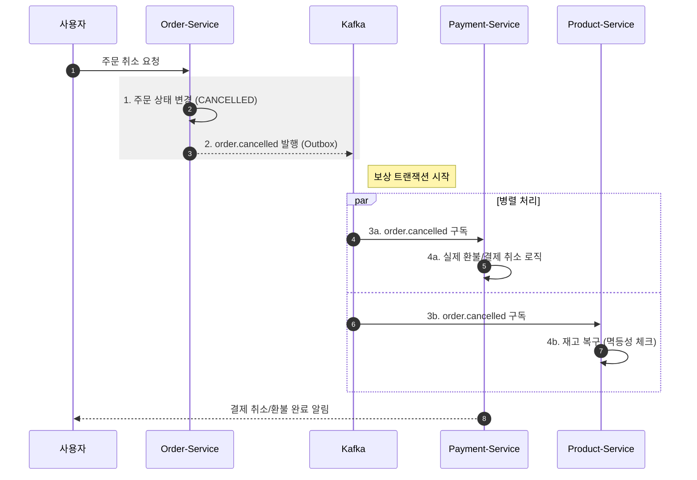

# order-service
주문 데이터를 생성하고 관리를 담당하는 MSA 서비스


### 주문 취소 프로세스

* 사용자/CS에서 주문 취소 요청을 하면 order.cancelled 이벤트를 발행한다.
* 주문 생성 후 10분 이내에 결제되지 않으면 order.cancelled 이벤트를 발행한다.


### 프로젝트 패키지 구조
```
com.example.authservice
├── common              # 유틸리티, 공통 상수
├── config              # 설정 클래스 (Security, JWT, CORS, Swagger 등)
├── consumer            # Kafka 이벤트 컨슈머
├── controller          # API 엔드포인트 (REST Controller)
├── domain
│   ├── entity/         # DB와 매핑되는 JPA 엔티티
│   └── event/          # 도메인 이벤트 클래스
├── dto                 # Request/Response 데이터 전송 객체
│   ├── request
│   └── response
├── exception           # 커스텀 예외 처리 및 Global Handler
├── repository          # DB 접근 (Spring Data JPA Interface)
└── service             # 비즈니스 로직 (JWT 토큰 생성/검증, 인증 처리)
```


### 백엔드 기술
* Spring Boot 3.5.10 (JDK 17)
* spring-boot-starter-web
* spring-boot-starter-data-jpa
* MySQL : 영속성 저장소
* Spring Kafka : 이벤트 메시징
* openfeign : Http Client
* Springwolf 1.20.0 : AsyncAPI 문서 자동 생성
* springdoc-openapi-starter-webmvc-ui:2.8.9 : Swagger
* spring-cloud-starter-config : Config Client
* eureka-client


### REST API

REST API 명세는 다음 방법으로 확인할 수 있다.

1. 브라우저에서 Swagger UI 열기: `/swagger-ui.html`
2. 정적 문서 확인: [`openapi.json`](./openapi.json)


### Events

Producer에서 Transaction Outbox 패턴을 적용하였다.  
Consumer에서 실패 처리 전략을 적용하여 메시지를 DLQ로 전송하도록 설계하고, 처리된 메시지는  
processed_events 테이블에서 관리하여 중복 전송 시에도 멱등성을 보장하도록 구성하였다.  
이벤트 상세 명세는 다음 방법으로 확인할 수 있다.

1. 브라우저에서 Swagger UI 열기: `/springwolf/asyncapi-ui.html`
2. 정적 문서 확인: [`asyncapi.yaml`](./asyncapi.yaml)

| 구분 | 설명 |
|-----|----|
| 발행(Published) | order.created, order.cancelled |
| 구독(Subscribed) | payment.confirmed |