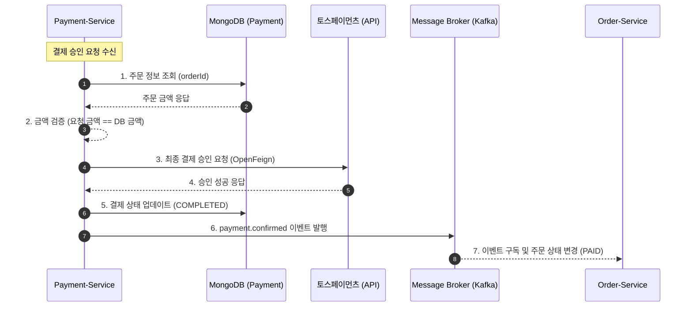
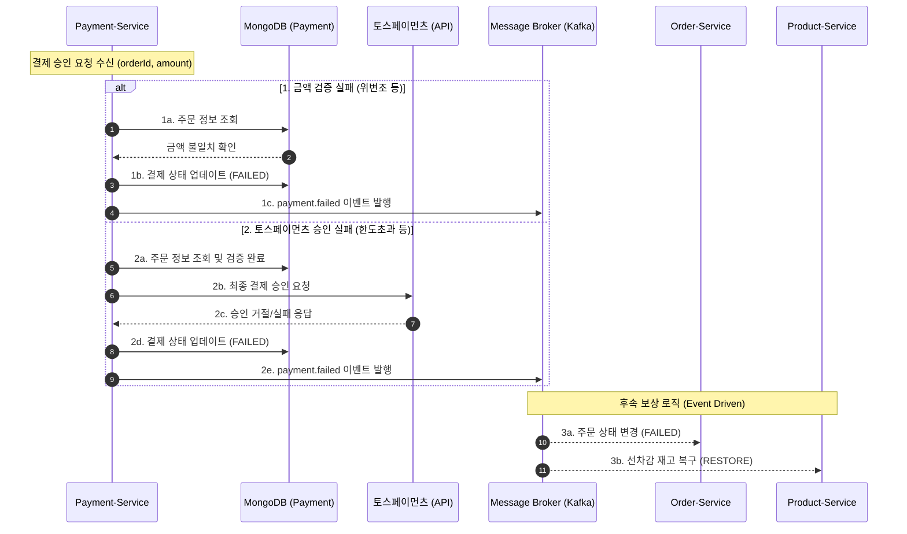

# payment-service

payment-service는 토스페이먼츠를 이용한 결제 서비스이며, 결제 승인 및 결제 상태 관리를 담당한다.
주 저장소는 MongoDB를 사용하며, 이 서비스는 다음과 같은 기능을 제공할 예정이다.


### MongoDB
payment-service에서 MongoDB를 저장소로 선택한 이유는 결제 검증 과정에서 핵심인 주문 데이터를 order.created  
이벤트를 구독하여 그대로 저장하고 조회하기에 적합하다고 판단했기 때문이다. 주문 하위 데이터를 포함한 문서 구조를  
그대로 저장할 수 있어, 복잡한 테이블 조인 없이 효율적으로 데이터를 관리할 수 있다. 또한 검색은 주로 order.id  
기반으로 이루어지며, 주문 상태 변경도 결제 완료 또는 결제 취소 정도로 제한적이어서, 복잡한 엔티티 조회가 필요하지 않다.  
이러한 이유로, MongoDB의 문서 지향 구조와 flexible schema가 payment-service의 데이터 모델과 사용 패턴에 가장 적합하다고 판단하였다.  


### 결제 승인 프로세스


1. 주문 정보 조회: MongoDB에서 orderId로 주문 정보 조회
2. 금액 검증: 요청된 amount와 저장된 주문 금액 비교 (결제 금액과 주문 금액 비교를 통한 위변조 방지)
3. 토스페이먼츠 승인 API 호출: OpenFeign으로 토스페이먼츠 승인 요청
4. 주문 상태 업데이트: 결제 승인 완료 상태로 변경
5. 결제 완료 이벤트 전파: 주문 서비스가 주문 완료 처리할 수 있도록 payment.confirmed 이벤트 발행

### 결제 승인 실패 프로세스


### 프로젝트 패키지 구조

```
com.example.paymentservice
├── client              # 토스페이먼츠 API Feign 클라이언트 및 인증 설정
├── config              # 설정 클래스 (Swagger 등)
├── controller          # API 엔드포인트 (REST Controller)
├── domain
│   ├── entity/         # MongoDB Document 엔티티
│   └── event/          # 도메인 이벤트 클래스
├── dto                 # Request/Response 데이터 전송 객체
│   ├── request/
│   └── response/
├── exception           # 커스텀 예외 처리 및 Global Handler
├── repository          # DB 접근 (Spring Data MongoDB Interface)
└── service             # 비즈니스 로직 (결제 승인 처리)
```


### 백엔드 기술

* Java 17
* Spring Boot 3.5.10
* Spring Data MongoDB : 주문 데이터 저장
* Spring Cloud OpenFeign : 토스페이먼츠 외부 API 호출
* springdoc-openapi 2.8.9 : OpenAPI 문서 자동 생성
* Lombok


### REST API

REST API 명세는 다음 방법으로 확인할 수 있다.

1. 브라우저에서 Swagger UI 열기: `/swagger-ui.html`


### Events

Producer에서 Transaction Outbox 패턴을 적용하였다.  
Consumer에서 실패 처리 전략을 적용하여 메시지를 DLQ로 전송하도록 설계하고, 처리된 메시지는  
processed_events 테이블에서 관리하여 중복 전송 시에도 멱등성을 보장하도록 구성하였다.  
이벤트 상세 명세는 다음 방법으로 확인할 수 있다.

1. 브라우저에서 Swagger UI 열기: `/springwolf/asyncapi-ui.html`
2. 정적 문서 확인: [`asyncapi.yaml`](./asyncapi.yaml)

| 구분 | 설명 |
|-----|-----|
| 발행(Published) | payment.confirmed, payment.cancelled |
| 구독(Subscribed) | order.created, order.cancelled |