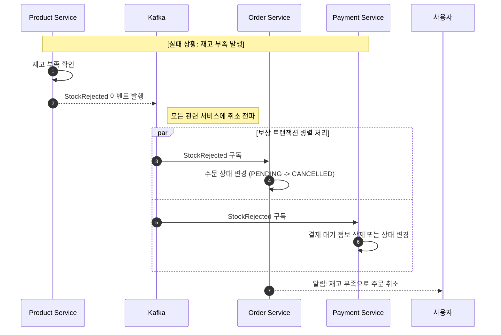
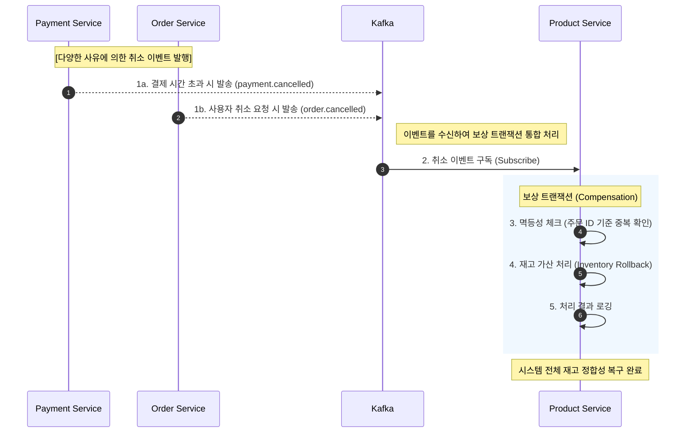

# product-service

product-service는 e-commerce MSA 시스템에서 **상품 도메인의 쓰기 모델**을 담당하는  
마이크로서비스이다. 상품의 생성, 수정, 삭제 및 가격, 옵션 등 핵심 비즈니스 규칙을 관리한다.  

사용자에게 제공되는 상품 조회 및 검색 기능은 CQRS 패턴에 따라 읽기 모델을 분리한 `catalog-service`에서 처리한다.  

상품 재고의 변경은 product-service에서 단일 책임으로 관리하며,  
조회 성능을 위해 catalog-service는 재고 정보를 비동기적으로 복제한다.


### 재고 부족 시 보상 트랜잭션 트리거

Product-Service는 order.created 이벤트를 구독하여 실시간 재고 차감을 수행한다. 만약 재고가 
부족할 경우 stock.rejected 이벤트를 발행하여 **보상 트랜잭션(Compensation Transaction)**을 
유도하며, 이를 통해 Order-Service가 주문을 즉시 취소 상태로 변경하도록 설계하였다. 또한, 분산 
환경에서의 중복 처리를 방지하기 위해 주문 ID 기반의 멱등성 로직을 적용하여 데이터 정합성을 보장한다.

### 결제 실패 및 주문 취소에 따른 재고 복구(Rollback)



### 프로젝트 패키지 구조
```
com.example.productservice/
├── ProductServiceApplication.java
├── global/                          # 전역 설정, 공통 모듈
│   ├── common/
│   │    └── dto/
│   ├── config/
│   ├── domain/
│   ├── exception/
│   ├── repository/
│   └── service/
│        └── outbox/                 # 이벤트 발행 Polling
├── product/                         # 상품 도메인
│   ├── controller/
│   ├── service/
│   ├── domain/
│   ├── repository/
│   └── dto/
├── file/                            # 파일 도메인
│   ├── ...
│   └── scheduler/
├── category/                        # 카테고리 도메인
│   ├── ...
├── display/                         # 화면/노출 도메인
│   ├── ...
└── search/                          # 검색 도메인
    ├── ...
```


### 백엔드 기술

* Java 17
* Spring Boot 3.5.9
* Spring Data JPA
* Spring Cloud Config : 외부 설정 서버 연동
* Spring Cloud Netflix Eureka Client : 서비스 디스커버리 등록
* Spring Kafka : 이벤트 메시징
* Springwolf 1.20.0 : AsyncAPI 문서 자동 생성
* springdoc-openapi 2.8.9 : OpenAPI 문서 자동 생성
* MySQL : 운영 데이터베이스
* H2 : 테스트 데이터베이스
* Lombok


### REST API

REST API 명세는 다음 방법으로 확인할 수 있다.

1. 브라우저에서 Swagger UI 열기: `/swagger-ui.html`


### Events

Producer에서 Transaction Outbox 패턴을 적용하였다.  
Consumer에서 실패 처리 전략을 적용하여 메시지를 DLQ로 전송하도록 설계하고, 처리된 메시지는  
processed_events 테이블에서 관리하여 중복 전송 시에도 멱등성을 보장하도록 구성하였다.  
이벤트 상세 명세는 다음 방법으로 확인할 수 있다.

1. 브라우저에서 Swagger UI 열기: `/springwolf/asyncapi-ui.html`
2. 정적 문서 확인: [`asyncapi.yaml`](./asyncapi.yaml)

| 구분 | 설명 |
|-----|------|
| 발행(Published) | product.created, product.updated, category.created, category.updated, category.deleted, keyword.created, keyword.deleted |
| 구독(Subscribed) | order.created, payment.cancelled, order.cancelled |