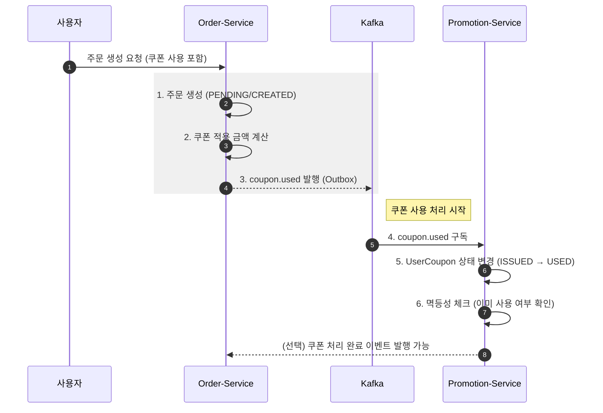
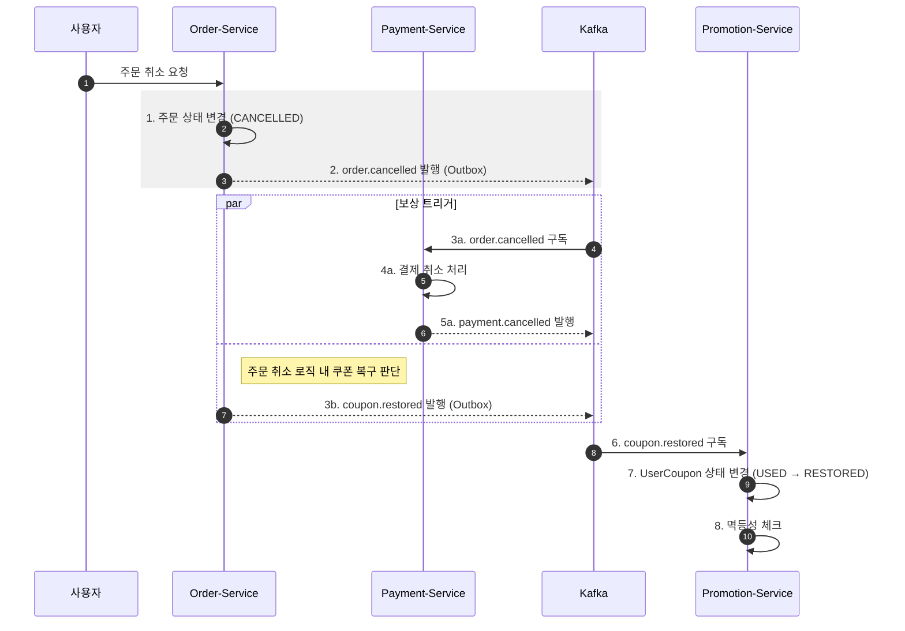

# promotion-service
쿠폰 및 할인 정책을 관리하고 사용자별 쿠폰 발급 및 사용 상태를 관리하는 서비스


### 쿠폰 사용 프로세스


### 쿠폰 롤백 프로세스

쿠폰 롤백은 order-service에서 주문 취소(order.cancelled) 또는 결제 취소(payment.cancelled)  
가 발생했을 때 수행된다. 해당 비즈니스 로직 내에서 coupon.restored 이벤트를 발행하고,  
promotion-service는 이를 구독하여 사용자 쿠폰 상태를 복구 처리한다.  


### 프로젝트 패키지 구조
```
com.example.promotionservice
├── common              # 유틸리티, 공통 상수
├── config              # 설정 클래스 (Security, JWT, CORS, Swagger 등)
├── consumer            # Kafka 이벤트 컨슈머
├── controller          # API 엔드포인트 (REST Controller)
├── domain
│   ├── entity/         # DB와 매핑되는 JPA 엔티티
│   └── event/          # 도메인 이벤트 클래스
├── dto                 # Request/Response 데이터 전송 객체
│   ├── request
│   └── response
├── exception           # 커스텀 예외 처리 및 Global Handler
├── repository          # DB 접근 (Spring Data JPA Interface)
└── service             # 비즈니스 로직 (JWT 토큰 생성/검증, 인증 처리)
```


### 백엔드 기술
* Spring Boot 3.5.10 (JDK 17)
* spring-boot-starter-web
* spring-boot-starter-data-jpa
* MySQL : 영속성 저장소
* Spring Kafka : 이벤트 메시징
* openfeign : Http Client
* Springwolf 1.20.0 : AsyncAPI 문서 자동 생성
* springdoc-openapi-starter-webmvc-ui:2.8.9 : Swagger
* spring-cloud-starter-config : Config Client
* eureka-client


### REST API

REST API 명세는 다음 방법으로 확인할 수 있다.

1. 브라우저에서 Swagger UI 열기: `/swagger-ui.html`
2. 정적 문서 확인: [`openapi.json`](./openapi.json)


### Events

Producer에서 Transaction Outbox 패턴을 적용하였다.  
Consumer에서 실패 처리 전략을 적용하여 메시지를 DLQ로 전송하도록 설계하고, 처리된 메시지는  
processed_events 테이블에서 관리하여 중복 전송 시에도 멱등성을 보장하도록 구성하였다.  
이벤트 상세 명세는 다음 방법으로 확인할 수 있다.

1. 브라우저에서 Swagger UI 열기: `/springwolf/asyncapi-ui.html`
2. 정적 문서 확인: [`asyncapi.yaml`](./asyncapi.yaml)

| 구분 | 설명 |
|-----|-----|
| 발행(Published) | - |
| 구독(Subscribed) | coupon.used, coupon.restored |