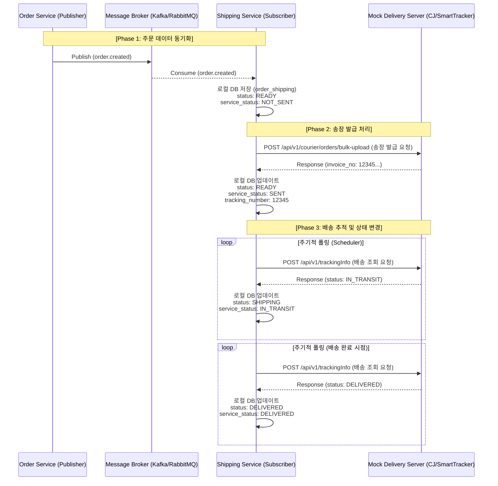
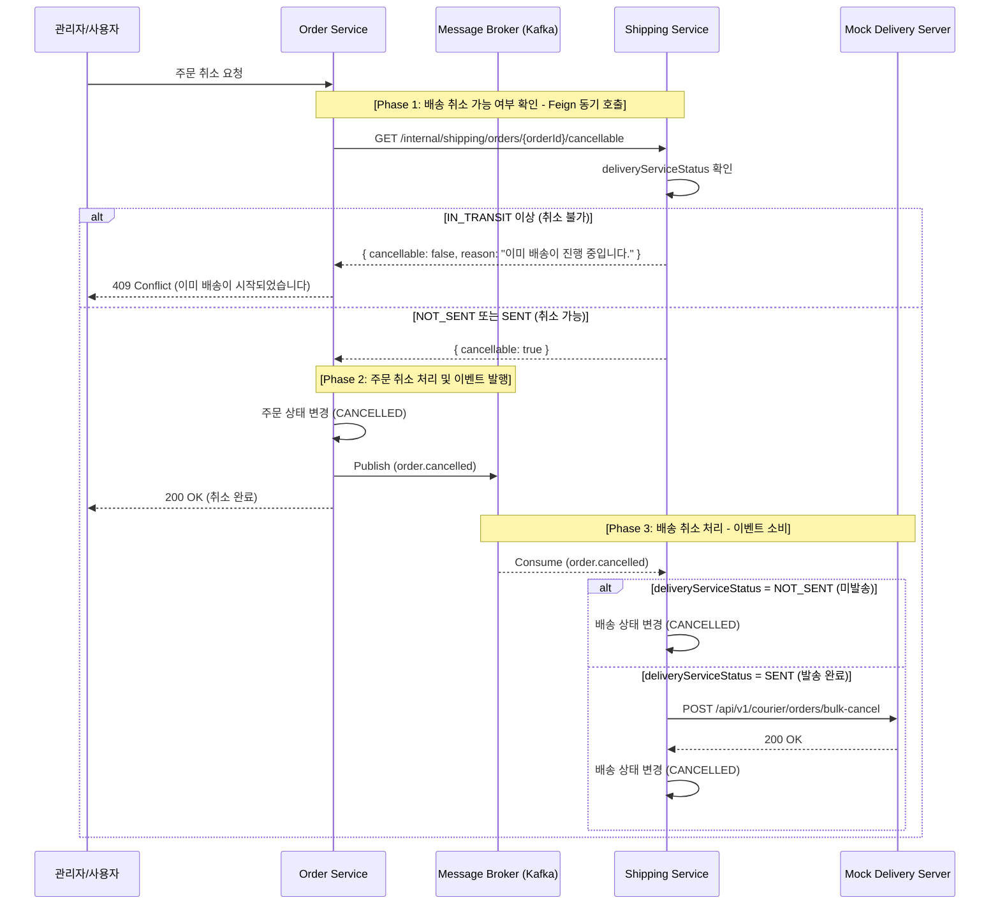

# shipping-service
외부 택배사 API와 연동하여 배송 처리를 담당하고, 반품·교환과 같은 업무까지 제공하는 MSA 기반 서비스이다.  
이 도메인 엔티티에서 가장 중요한 개념은 우리 서비스의 배송 상태(shipping_status)와 외부 택배사 API 연동  
상태(delivery_service_status)를 분리하여 관리하는 것이다.  
우리 서비스의 배송 상태가 SHIPPING이라는 것은 외부 배송사에 배송 요청이 완료되었음을 의미한다.  
그리고 배송사 연동 상태를 통해 실제 택배가 현재 어떤 단계까지 진행되었는지를 보다 상세하게 파악할 수 있다.  


### Full Sync API
Full Sync API는 shipping-service 구축 시, order-service에 존재하는 배송 대상 주문 데이터를 이관하기  
위해 사용된다. 상품 Full Sync API를 구현했던 방식과 동일하게 멱등성을 보장하여, 동일한 데이터를 여러 번  
수신하더라도 문제가 발생하지 않도록 설계한다.  


### 배송 프로세스



### 배송 취소 프로세스
취소 가능 여부 확인은 Feign 동기 호출로 즉각적인 피드백을 제공하고,
실제 배송 취소 처리는 `order.cancelled` 이벤트를 소비하여 비동기로 수행한다.




### 프로젝트 패키지 구조
```
com.example.shippingservice
├── common              # 유틸리티, 공통 상수
├── config              # 설정 클래스 (Security, JWT, CORS, Swagger 등)
├── consumer            # Kafka 이벤트 컨슈머
├── exception           # 커스텀 예외 처리 및 Global Handler
├── exchange            # 교환 도메인 패키지
│   ├── controller      # API 엔드포인트 (REST Controller)
│   ├── repository      # DB 접근 (Spring Data JPA Interface)
│   ├── service         # 비즈니스 로직 (JWT 토큰 생성/검증, 인증 처리)
│   ├── entity
│   └── dto
├── exchange            # 환불 도메인 패키지
│   ├── ...
├── shipping            # 배송 도메인 패키지
│   └── ...
```


### 백엔드 기술
* Spring Boot 3.5.10 (JDK 17)
* spring-boot-starter-web
* spring-boot-starter-data-jpa
* MySQL : 영속성 저장소
* Spring Kafka : 이벤트 메시징
* openfeign : Http Client
* Springwolf 1.20.0 : AsyncAPI 문서 자동 생성
* springdoc-openapi-starter-webmvc-ui:2.8.9 : Swagger
* spring-cloud-starter-config : Config Client
* eureka-client


### REST API

REST API 명세는 다음 방법으로 확인할 수 있다.

1. 브라우저에서 Swagger UI 열기: `/swagger-ui.html`
2. 정적 문서 확인: [`openapi.json`](./openapi.json)


### Events

Producer에서 Transaction Outbox 패턴을 적용하였다.  
Consumer에서 실패 처리 전략을 적용하여 메시지를 DLQ로 전송하도록 설계하고, 처리된 메시지는  
processed_events 테이블에서 관리하여 중복 전송 시에도 멱등성을 보장하도록 구성하였다.  
이벤트 상세 명세는 다음 방법으로 확인할 수 있다.

1. 브라우저에서 Swagger UI 열기: `/springwolf/asyncapi-ui.html`
2. 정적 문서 확인: [`asyncapi.yaml`](./asyncapi.yaml)

| 구분 | 설명 |
|-----|-----|
| 발행(Published) |  |
| 구독(Subscribed) | order.created, order.cancelled |