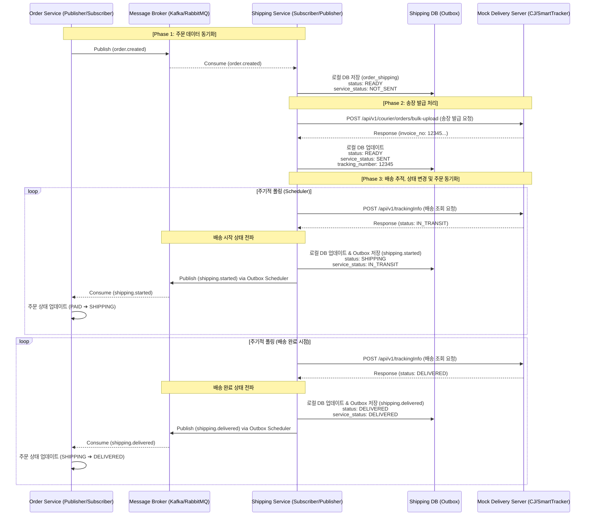
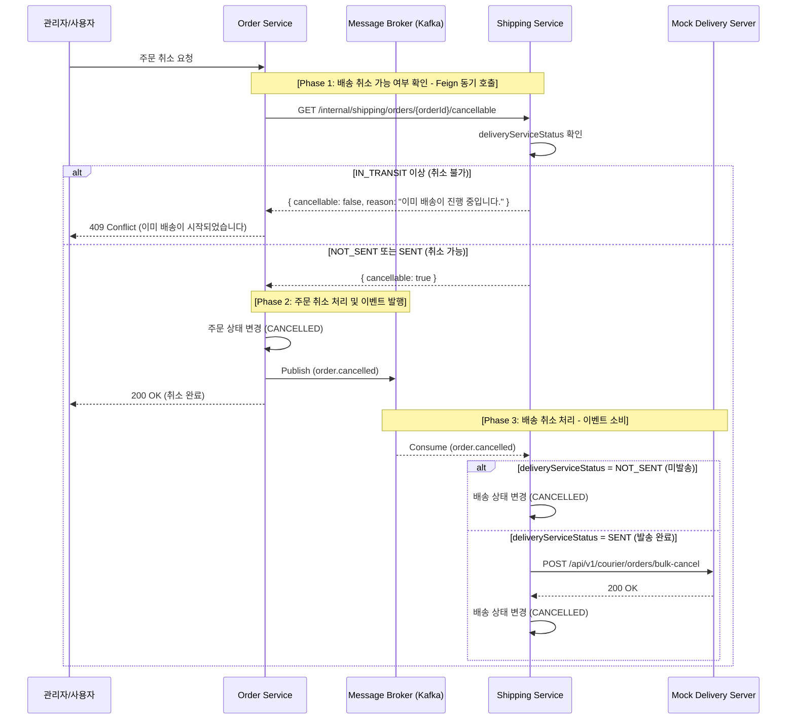
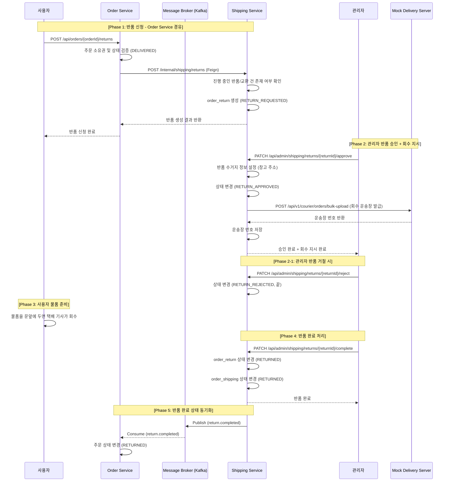
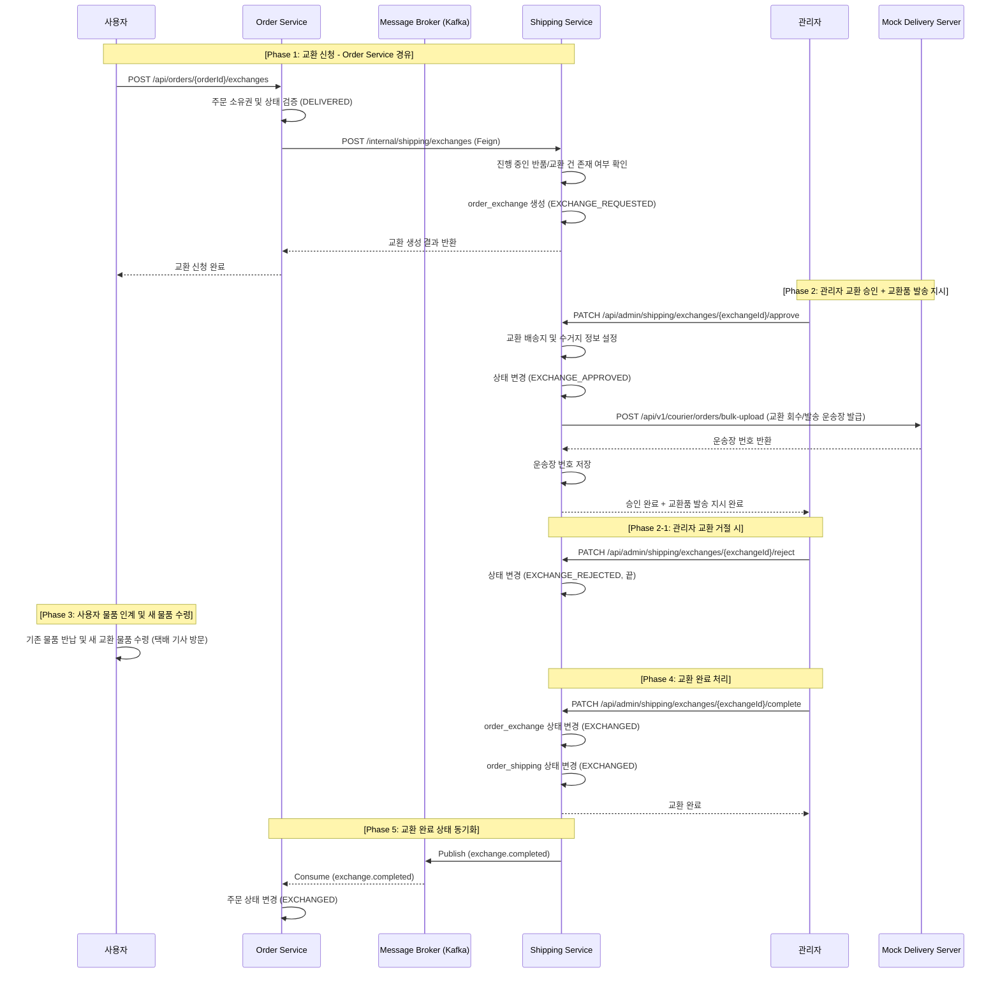

# shipping-service
외부 택배사 API와 연동하여 배송 처리를 담당하고, 반품·교환과 같은 업무까지 제공하는 MSA 기반 서비스이다.  
이 도메인 엔티티에서 가장 중요한 개념은 우리 서비스의 배송 상태(shipping_status)와 외부 택배사 API 연동  
상태(delivery_service_status)를 분리하여 관리하는 것이다.  
우리 서비스의 배송 상태가 SHIPPING이라는 것은 외부 배송사에 배송 요청이 완료되었음을 의미한다.  
그리고 배송사 연동 상태를 통해 실제 택배가 현재 어떤 단계까지 진행되었는지를 보다 상세하게 파악할 수 있다.  


### Full Sync API
Full Sync API는 shipping-service 구축 시, order-service에 존재하는 배송 대상 주문 데이터를 이관하기  
위해 사용된다. 상품 Full Sync API를 구현했던 방식과 동일하게 멱등성을 보장하여, 동일한 데이터를 여러 번  
수신하더라도 문제가 발생하지 않도록 설계한다.  


### 배송 E2E 테스트 및 데이터 세팅 전략
배송은 주문과 결제 이후에 진행되는 프로세스이므로, 구현 및 수정 후 테스트를 위해 매번 주문과 결제를 수행할 수는 없다.  
따라서 결제 완료 상태의 주문 데이터가 바로 필요하며, 처음에는 이를 직접 SQL INSERT문으로 저장하려고 했다.  
하지만 재고 서비스의 재고 감소는 생략한다고 하더라도, 주문 서비스, 결제 서비스, 배송 서비스(주문 생성 이후 배송 정보를  
저장해야 함)에 각각 데이터를 일일이 쿼리로 넣는 것은 번거롭고, 특히 결제 서비스는 RDB가 아닌 MongoDB를 사용하고 있어  
관리가 더 어렵다. 그래서 각 서비스에 테스트용 API를 만들기로 결정했다.  
주문 서비스의 테스트 API가 다른 서비스의 테스트 API를 호출하여, 각 서비스가 필요로 하는 상태를 정확하게 세팅하도록 구성하였다.  
한 서비스에서 모든 데이터를 세팅하면 서비스 간 결합도가 높아지므로, 각 서비스가 독립적으로 테스트 API를 제공하는 것이 바람직하다.  

이 테스트는 E2E 테스트를 목적으로 하며, 배송 로직 검증과 함께 각 서비스 간의 일관성 있는 흐름을 검증하는 것이 목표다.  
만약 배송 로직만 단독으로 검증하려는 경우에는, 테스트 코드에서 외부 서비스 및 모듈을 Mock이나 Stub으로 처리하여  
간단하게 테스트할 수도 있다. 마지막으로, 테스트 후 데이터를 깔끔하게 정리할 수 있도록 테스트 데이터 삭제 API도 구현하였다.  


### 배송 프로세스



### 배송 취소 프로세스
취소 가능 여부 확인은 Feign 동기 호출로 즉각적인 피드백을 제공하고,
실제 배송 취소 처리는 `order.cancelled` 이벤트를 소비하여 비동기로 수행한다.




### 반품 프로세스
반품은 배송 완료(`DELIVERED`) 상태인 주문에 대해 사용자가 반품을 신청하고,
관리자가 승인하면 **시스템이 자동으로 택배사에 회수 지시**를 내려 물품을 회수한 뒤 반품을 완료하는 흐름이다.
반품이 완료되면 `order_shipping`의 상태도 `RETURNED`로 변경된다.

기존 아키텍처와 동일하게 **사용자의 반품 신청은 Order-Service를 경유**하여 들어온다.
Order-Service가 주문 상태를 검증한 뒤 Shipping-Service의 내부 API를 Feign으로 호출하여
반품 레코드를 생성한다. 이후 물류 관리(승인, 거절, 완료)는 관리자가 Shipping-Service에서 직접 처리한다.

반품 신청 시 해당 주문에 대한 진행 중인 반품 또는 교환 건이 없어야 한다.
관리자가 반품을 거절하는 경우도 존재하며, 이를 위해 `ReturnStatus`에 `RETURN_REJECTED` 상태가 필요하다.

**현대적 반품 프로세스의 핵심:** 관리자가 반품을 승인하면 Mock 택배사 API를 통해 회수 운송장이 자동 발급된다.
사용자는 물품을 문앞에 두기만 하면 택배 기사가 방문하여 회수해 가므로, 사용자가 직접 택배를 붙이거나 운송장을 등록할 필요가 없다.

#### 상태 흐름
```
RETURN_REQUESTED → RETURN_APPROVED → RETURNED
                 ↘ RETURN_REJECTED
```

#### 시퀀스 다이어그램



### 교환 프로세스
교환은 배송 완료(`DELIVERED`) 상태인 주문에 대해 사용자가 교환을 신청하고,
관리자가 승인한 뒤 기존 물품을 회수하고 새 물품을 발송하여 교환을 완료하는 흐름이다.

반품과 마찬가지로 **사용자의 교환 신청은 Order-Service를 경유**한다.
교환은 반품과 달리 **회수 + 재발송**이 모두 필요하므로 프로세스가 더 복잡하다.
관리자가 교환을 승인하면 Mock 택배사 API를 통해 교환품의 송장을 자동 발급한다.
교환이 완료되면 기존 `order_shipping`의 상태는 변경하지 않으며(`DELIVERED` 유지),
교환 배송 정보는 `order_exchange` 테이블에서 독립적으로 관리한다.

교환 신청 시 해당 주문에 대한 진행 중인 반품 또는 교환 건이 없어야 한다.
관리자가 교환을 거절하는 경우도 존재하며, 이를 위해 `ExchangeStatus`에 `EXCHANGE_REJECTED` 상태가 필요하다.

#### 상태 흐름
```
EXCHANGE_REQUESTED → EXCHANGE_APPROVED → EXCHANGED
                   ↘ EXCHANGE_REJECTED
```

#### 시퀀스 다이어그램



### 반품/교환 공통 정책
- **사용자 신청은 Order-Service를 경유**하여 주문 소유권 및 상태 검증 후 Shipping-Service 내부 API를 Feign으로 호출한다
- 반품·교환 신청 가능 조건: `order_shipping.shipping_status = DELIVERED`
- 하나의 주문에 대해 **반품 또는 교환 중 하나만** 진행 가능 (진행 중인 건이 있으면 신규 신청 불가)
- 거절된 건(`RETURN_REJECTED`, `EXCHANGE_REJECTED`)은 재신청 가능
- 반품·교환 승인 시 **Mock 택배사 API를 통해 운송장을 자동 발급**한다 (반품은 회수 운송장, 교환은 새 물품 발송 운송장)
- 사용자는 반품 승인 후 물품을 문앞에 두기만 하면 택배 기사가 회수해 간다 (사용자가 직접 택배를 붙이거나 운송장을 등록할 필요 없음)
- 물류 조회(반품/교환 목록)와 관리(승인, 거절, 완료)는 Shipping-Service에서 직접 처리한다


### 프로젝트 패키지 구조
```
com.example.shippingservice
├── common              # 유틸리티, 공통 상수
├── config              # 설정 클래스 (Security, JWT, CORS, Swagger 등)
├── consumer            # Kafka 이벤트 컨슈머
├── exception           # 커스텀 예외 처리 및 Global Handler
├── exchange            # 교환 도메인 패키지
│   ├── controller      # API 엔드포인트 (REST Controller)
│   ├── repository      # DB 접근 (Spring Data JPA Interface)
│   ├── service         # 비즈니스 로직
│   ├── entity
│   └── dto
├── returns             # 반품 도메인 패키지
│   ├── controller
│   ├── repository
│   ├── service
│   ├── entity
│   └── dto
├── shipping            # 배송 도메인 패키지
│   └── ...
```


### 백엔드 기술
* Spring Boot 3.5.10 (JDK 17)
* spring-boot-starter-web
* spring-boot-starter-data-jpa
* MySQL : 영속성 저장소
* Spring Kafka : 이벤트 메시징
* openfeign : Http Client
* Springwolf 1.20.0 : AsyncAPI 문서 자동 생성
* springdoc-openapi-starter-webmvc-ui:2.8.9 : Swagger
* spring-cloud-starter-config : Config Client
* eureka-client


### REST API

REST API 명세는 다음 방법으로 확인할 수 있다.

1. 브라우저에서 Swagger UI 열기: `/swagger-ui.html`
2. 정적 문서 확인: [`openapi.json`](./openapi.json)


### Events

Producer에서 Transaction Outbox 패턴을 적용하였다.  
Consumer에서 실패 처리 전략을 적용하여 메시지를 DLQ로 전송하도록 설계하고, 처리된 메시지는  
processed_events 테이블에서 관리하여 중복 전송 시에도 멱등성을 보장하도록 구성하였다.  
이벤트 상세 명세는 다음 방법으로 확인할 수 있다.

1. 브라우저에서 Swagger UI 열기: `/springwolf/asyncapi-ui.html`
2. 정적 문서 확인: [`asyncapi.yaml`](./asyncapi.yaml)

| 구분 | 설명 |
|-----|-----|
| 발행(Published) | shipping.started, shipping.delivered, return.completed |
| 구독(Subscribed) | order.created, order.cancelled |