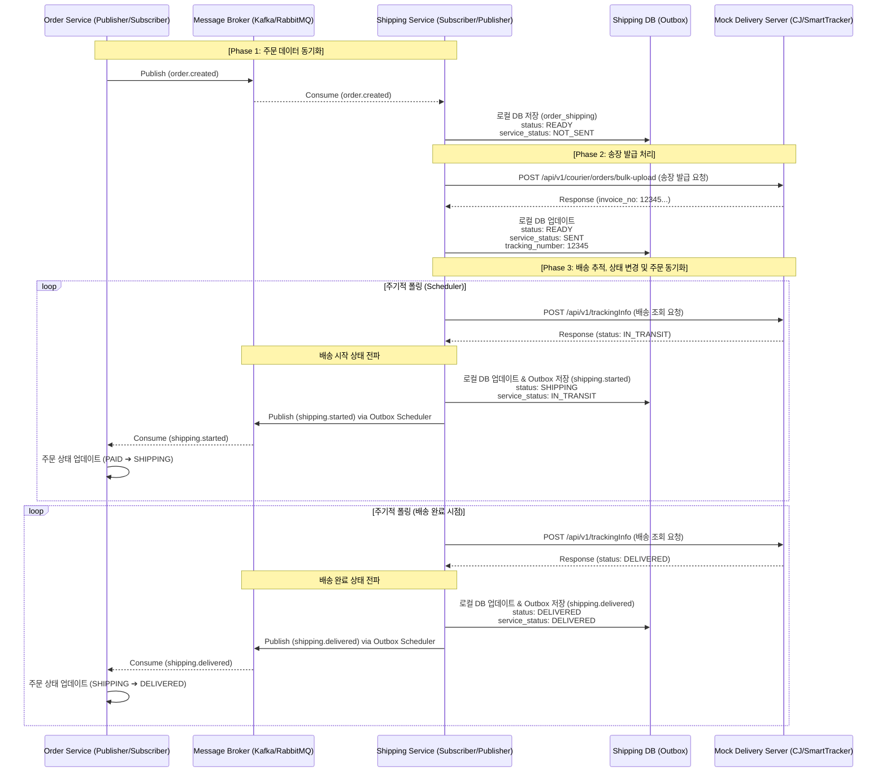
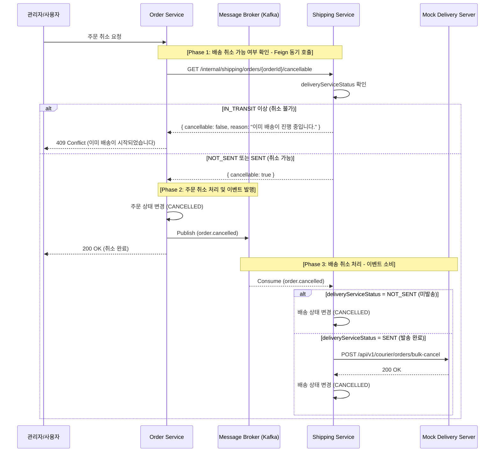
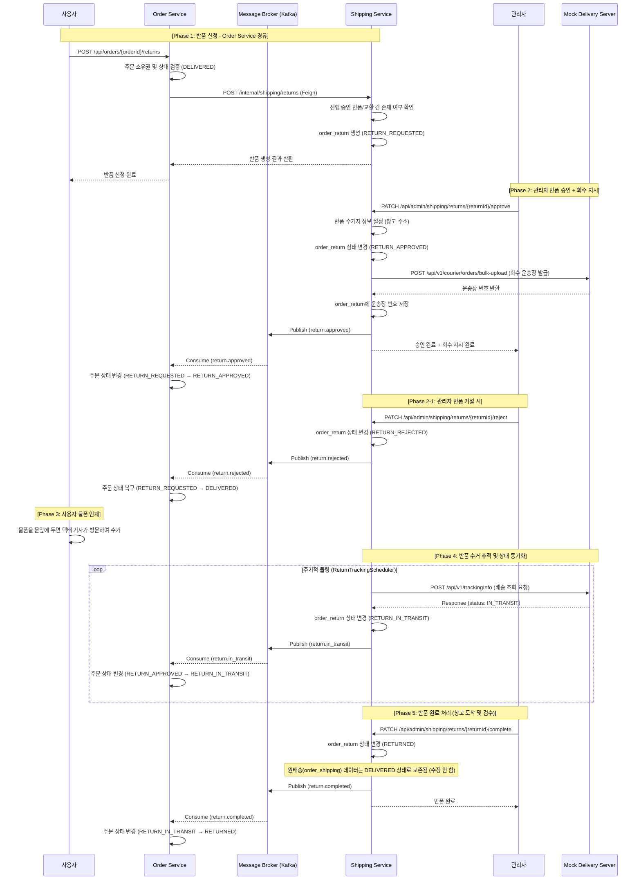
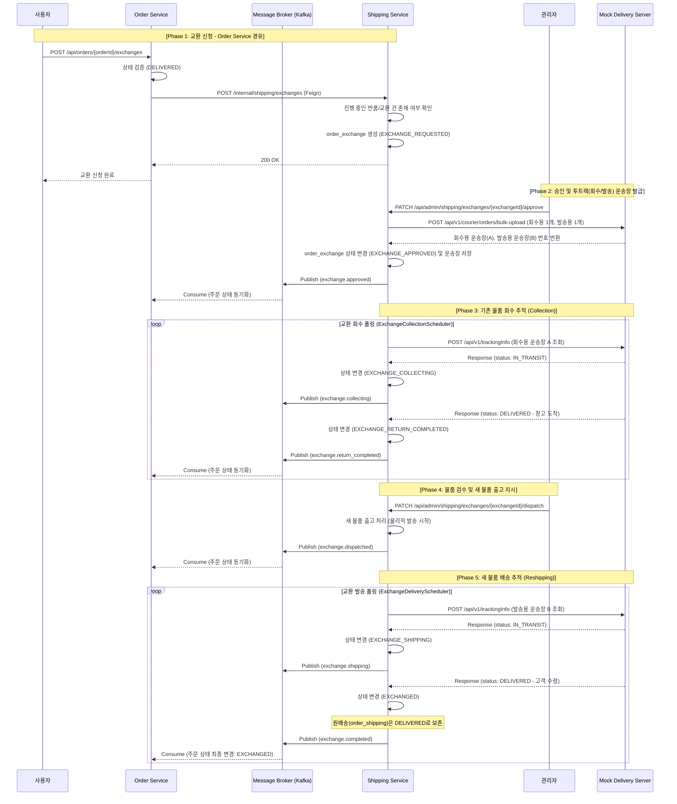

# shipping-service
외부 택배사 API와 연동하여 배송 처리를 담당하고, 반품·교환과 같은 업무까지 제공하는 MSA 기반 서비스이다.  
이 도메인 엔티티에서 가장 중요한 개념은 우리 서비스의 배송 상태(shipping_status)와 외부 택배사 API 연동  
상태(delivery_service_status)를 분리하여 관리하는 것이다.  
우리 서비스의 배송 상태가 SHIPPING이라는 것은 외부 배송사에 배송 요청이 완료되었음을 의미한다.  
그리고 배송사 연동 상태를 통해 실제 택배가 현재 어떤 단계까지 진행되었는지를 보다 상세하게 파악할 수 있다.  


### 원배송과 클레임 도메인의 분리
* 상태 관리의 주체 분리 : 주문 서비스(Order Service)는 주문 생성부터 교환/반품까지 전체 생명주기(Lifecycle)를 총괄한다. 반면 배송 서비스(Shipping Service) 내에서는 원배송(order_shipping)과 클레임(order_return, order_exchange) 테이블을 물리적으로 완전히 분리하여 관리한다.
* 원배송의 생명주기 종료 : 배송 도메인의 책임은 상품이 고객에게 도달하는 '배송 완료' 시점에서 끝난다. 따라서 원배송 테이블은 이후 발생하는 반품이나 교환 프로세스의 영향을 받지 않으며, 클레임 처리는 전적으로 반품/교환 전용 테이블과 그 이력(History) 테이블에서 독립적으로 수행된다. (※ 이상적인 MSA 환경이라면 클레임 도메인을 별도의 서비스로 분리하는 것이 정석)
* 조회(Read)와 쓰기(Write)의 분리 : 데이터 저장 구조는 도메인별로 분리되어 있지만, 사용자나 관리자가 '통합 배송 이력'을 조회할 때는 프론트엔드의 요구사항에 맞춰 데이터를 병합하여 제공한다. 단일 DB 환경이라면 UNION 쿼리를, 서비스가 분리된 환경이라면 API 단에서 이력을 조합(Aggregation)하여 시간순으로 일관된 응답을 내려줄 수 있다.


### Full Sync API
Full Sync API는 shipping-service 구축 시, order-service에 존재하는 배송 대상 주문 데이터를 이관하기  
위해 사용된다. 상품 Full Sync API를 구현했던 방식과 동일하게 멱등성을 보장하여, 동일한 데이터를 여러 번  
수신하더라도 문제가 발생하지 않도록 설계한다.  


### 배송 E2E 테스트 및 데이터 세팅 전략
배송은 주문과 결제 이후에 진행되는 프로세스이므로, 구현 및 수정 후 테스트를 위해 매번 주문과 결제를 수행할 수는 없다.  
따라서 결제 완료 상태의 주문 데이터가 바로 필요하며, 처음에는 이를 직접 SQL INSERT문으로 저장하려고 했다.  
하지만 재고 서비스의 재고 감소는 생략한다고 하더라도, 주문 서비스, 결제 서비스, 배송 서비스(주문 생성 이후 배송 정보를  
저장해야 함)에 각각 데이터를 일일이 쿼리로 넣는 것은 번거롭고, 특히 결제 서비스는 RDB가 아닌 MongoDB를 사용하고 있어  
관리가 더 어렵다. 그래서 각 서비스에 테스트용 API를 만들기로 결정했다.  
주문 서비스의 테스트 API가 다른 서비스의 테스트 API를 호출하여, 각 서비스가 필요로 하는 상태를 정확하게 세팅하도록 구성하였다.  
한 서비스에서 모든 데이터를 세팅하면 서비스 간 결합도가 높아지므로, 각 서비스가 독립적으로 테스트 API를 제공하는 것이 바람직하다.  

이 테스트는 E2E 테스트를 목적으로 하며, 배송 로직 검증과 함께 각 서비스 간의 일관성 있는 흐름을 검증하는 것이 목표다.  
만약 배송 로직만 단독으로 검증하려는 경우에는, 테스트 코드에서 외부 서비스 및 모듈을 Mock이나 Stub으로 처리하여  
간단하게 테스트할 수도 있다. 마지막으로, 테스트 후 데이터를 깔끔하게 정리할 수 있도록 테스트 데이터 삭제 API도 구현하였다.


### 배송 프로세스



### 배송 취소 프로세스
취소 가능 여부 확인은 Feign 동기 호출로 즉각적인 피드백을 제공하고,
실제 배송 취소 처리는 `order.cancelled` 이벤트를 소비하여 비동기로 수행한다.




### 반품 프로세스
반품은 배송 완료(DELIVERED)된 주문에 대해 사용자가 반품을 신청하고, 관리자가 승인하면  
**시스템이 자동으로 택배사에 회수 지시**를 내려 물품을 회수하는 흐름이다. 반품의 모든 생명주기는 원배송을  
오염시키지 않고 전용 클레임 테이블(order_return, order_return_history)에서 독립적으로 관리된다.  

사용자의 반품 신청은 기존과 동일하게 Order-Service를 경유하여 들어온다. Order-Service가 주문 상태를  
검증한 뒤 Shipping-Service의 내부 API를 호출(Feign)하여 반품 레코드를 생성한다.  

현대적 반품 프로세스의 핵심: 관리자가 반품을 승인하면 Mock 택배사 API를 통해 회수 운송장이 자동 발급된다.  
이후 반품 전용 스케줄러(ReturnTrackingScheduler)가 택배사 API를 폴링하여 물품 수거(RETURN_IN_TRANSIT)  
상태를 추적하고, 카프카(Kafka) 이벤트를 통해 Order-Service로 즉각 동기화한다. 사용자는 문앞에 물품을 두기만  
하면 되며, 직접 운송장을 등록할 필요가 없다.  
마지막으로, 실제 운영 시스템에서는 반품 상품을 회수하고 검수한 뒤 최종 반품 확정에 이르기까지 추가적인 상태 값이  
존재할 수 있다. 그러나 이번 사이드 프로젝트에서는 구현을 간소화하기 위해 이러한 상태들은 생략하였다.

#### 상태 흐름
```
RETURN_REQUESTED → RETURN_APPROVED → RETURN_IN_TRANSIT → RETURNED
                 ↘ RETURN_REJECTED
```

#### 시퀀스 다이어그램



### 교환 프로세스
교환은 배송 완료(DELIVERED) 상태인 주문에 대해 사용자가 교환을 신청하고, 관리자가 승인하면 기존 물품을
먼저 회수(Return)하고 검수를 거친 뒤, 새 물품을 재발송(Reship)하여 완료하는 복잡한 흐름을 가진다.

반품과 달리 회수용 운송장과 재발송용 운송장 두 개가 발급되며, 각각의 배송 상태를 순차적으로 추적해야 한다.  
교환의 모든 생명주기는 원배송(order_shipping)을 오염시키지 않고 전용 클레임 테이블(order_exchange,  
order_exchange_history)에서 독립적으로 관리된다.

교환 신청은 Order-Service를 경유하며, 해당 주문에 진행 중인 다른 클레임(반품/교환)이 없어야 한다.
스케줄러는 먼저 회수 상태를 폴링하여 완료를 감지하고, 이후 관리자의 검수/출고 처리가 이뤄지면 새 물품의 배송
상태를 폴링하여 최종 완료 처리한다.

#### 상태 흐름
```
EXCHANGE_REQUESTED (교환 신청) 
  → EXCHANGE_APPROVED (승인 및 회수/발송 운송장 발급) 
  → EXCHANGE_COLLECTING (기존 물품 회수 중) 
  → EXCHANGE_RETURN_COMPLETED (회수 완료 및 검수 대기)
  → EXCHANGE_SHIPPING (새 물품 발송 중)
  → EXCHANGED (교환 최종 완료)
```

#### 시퀀스 다이어그램



### 프로젝트 패키지 구조
```
com.example.shippingservice
├── common              # 유틸리티, 공통 상수
├── config              # 설정 클래스 (Security, JWT, CORS, Swagger 등)
├── consumer            # Kafka 이벤트 컨슈머
├── exception           # 커스텀 예외 처리 및 Global Handler
├── exchange            # 교환 도메인 패키지
│   ├── controller      # API 엔드포인트 (REST Controller)
│   ├── repository      # DB 접근 (Spring Data JPA Interface)
│   ├── service         # 비즈니스 로직
│   ├── entity
│   └── dto
├── returns             # 반품 도메인 패키지
│   ├── controller
│   ├── repository
│   ├── service
│   ├── entity
│   └── dto
├── shipping            # 배송 도메인 패키지
│   └── ...
```


### 백엔드 기술
* Spring Boot 3.5.10 (JDK 17)
* spring-boot-starter-web
* spring-boot-starter-data-jpa
* MySQL : 영속성 저장소
* Spring Kafka : 이벤트 메시징
* openfeign : Http Client
* Springwolf 1.20.0 : AsyncAPI 문서 자동 생성
* springdoc-openapi-starter-webmvc-ui:2.8.9 : Swagger
* spring-cloud-starter-config : Config Client
* eureka-client


### REST API

REST API 명세는 다음 방법으로 확인할 수 있다.

1. 브라우저에서 Swagger UI 열기: `/swagger-ui.html`
2. 정적 문서 확인: [`openapi.json`](./openapi.json)


### Events

Producer에서 Transaction Outbox 패턴을 적용하였다.  
Consumer에서 실패 처리 전략을 적용하여 메시지를 DLQ로 전송하도록 설계하고, 처리된 메시지는  
processed_events 테이블에서 관리하여 중복 전송 시에도 멱등성을 보장하도록 구성하였다.  
이벤트 상세 명세는 다음 방법으로 확인할 수 있다.

1. 브라우저에서 Swagger UI 열기: `/springwolf/asyncapi-ui.html`
2. 정적 문서 확인: [`asyncapi.yaml`](./asyncapi.yaml)

| 구분 | 설명 |
|-----|-----|
| 발행(Published) | shipping.started, shipping.delivered, return.approved, return.in-transit, return.completed |
| 구독(Subscribed) | order.created, order.cancelled |